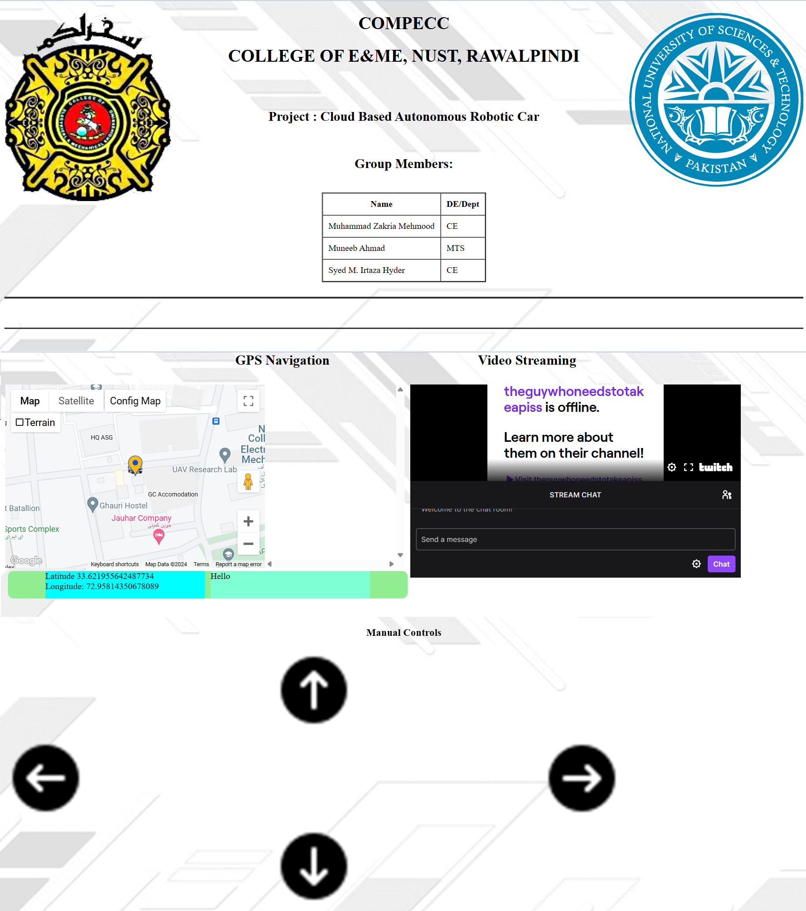
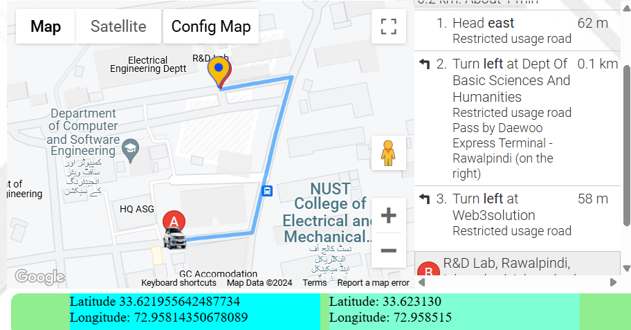
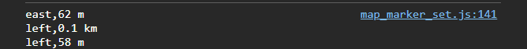
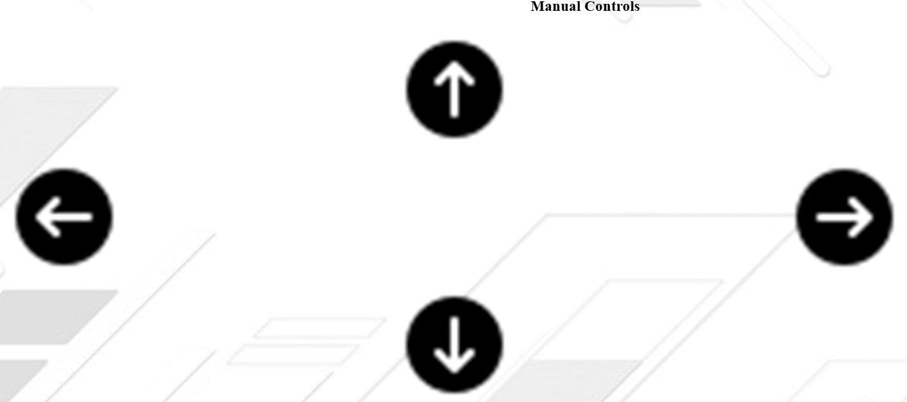

# Flask Webpage
We used Flask as the backend of our project. This website was deployed on Azure App Service. Azure IoT Hub resource was used to communicate between the WebApp and Device (Raspberry Pi 3.5B). Github was choosen for the deployment workflow. The Frontend is programmed using HTML, CSS and JS.

## Features
### Google Maps
Integration of Google Maps Marker and Direction API in JS. The user's live location was displayed on Google Maps, and where the user tapped, the Google Direction API sent direction and distance data to the Raspberry Pi.

*Data being displayed on Google Maps UI*

*Data recieved by Raspberry Pi*

### Manual Controls
Manual Controls were also present on the website. These were triggered by pressing the buttons shown below.

### Live Streaming
Using webcam, we were able to livestream on twitch using the Raspberry Pi. An embedded twitch link was used in HTML to display the stream. The stream was 30 fps with 20 second latency.

